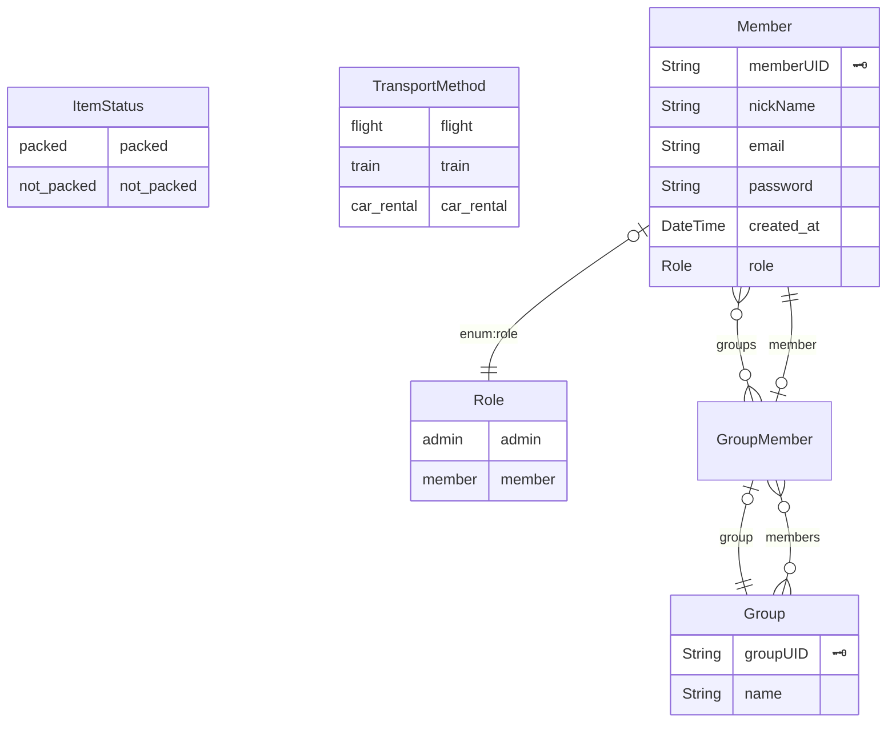

```mermaid
erDiagram

        ItemStatus {
            packed packed
not_packed not_packed
        }
    


        TransportMethod {
            flight flight
train train
car_rental car_rental
        }
    


        Role {
            admin admin
member member
        }
    
  "Member" {
    String memberUID "🗝️"
    String nickName 
    String email 
    String password 
    DateTime created_at 
    Role role 
    }
  

  "Group" {
    String groupUID "🗝️"
    String name 
    }
  

  "GroupMember" {

    }
  
    "Member" o|--|| "Role" : "enum:role"
    "Member" o{--}o "GroupMember" : "groups"
    "Group" o{--}o "GroupMember" : "members"
    "GroupMember" o|--|| "Group" : "group"
    "GroupMember" o|--|| "Member" : "member"
```
