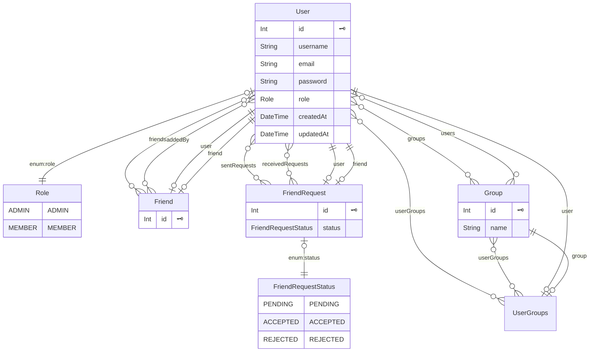

```mermaid
erDiagram

        Role {
            ADMIN ADMIN
MEMBER MEMBER
        }
    


        FriendRequestStatus {
            PENDING PENDING
ACCEPTED ACCEPTED
REJECTED REJECTED
        }
    
  "User" {
    Int id "🗝️"
    String username 
    String email 
    String password 
    Role role 
    DateTime createdAt 
    DateTime updatedAt 
    }
  

  "Friend" {
    Int id "🗝️"
    }
  

  "FriendRequest" {
    Int id "🗝️"
    FriendRequestStatus status 
    }
  

  "Group" {
    Int id "🗝️"
    String name 
    }
  

  "UserGroups" {

    }
  
    "User" o|--|| "Role" : "enum:role"
    "User" o{--}o "FriendRequest" : "sentRequests"
    "User" o{--}o "FriendRequest" : "receivedRequests"
    "User" o{--}o "Friend" : "friends"
    "User" o{--}o "Friend" : "addedBy"
    "User" o{--}o "Group" : "groups"
    "User" o{--}o "UserGroups" : "userGroups"
    "Friend" o|--|| "User" : "user"
    "Friend" o|--|| "User" : "friend"
    "FriendRequest" o|--|| "FriendRequestStatus" : "enum:status"
    "FriendRequest" o|--|| "User" : "user"
    "FriendRequest" o|--|| "User" : "friend"
    "Group" o{--}o "User" : "users"
    "Group" o{--}o "UserGroups" : "userGroups"
    "UserGroups" o|--|| "User" : "user"
    "UserGroups" o|--|| "Group" : "group"
```
